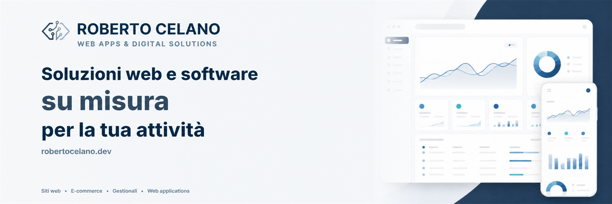

  

  
  
  

## 👋 About me

I build custom websites and software for businesses, turning ideas and workflows into clear, reliable digital tools.

Based in Vasto, Italy, and available for remote collaborations.

## 🚀 What I build

- Websites, landing pages, and e-commerce
- Custom business software, dashboards, and internal tools
- Booking, management, and workflow systems
- API integrations, maintenance, and continuous improvements

## 🛠️ Tech stack

  
  
  
  
  
  
  
  

**Backend:** PHP, Laravel, MySQL  
**Frontend:** JavaScript, HTML, CSS, Bootstrap  
**Workflow:** Git, GitHub  
**Integrations:** REST APIs and third-party services

## 🤝 How I work

- One point of contact, from the first conversation to delivery and support
- Clear scope, timing, and costs before development begins
- Responsive, accessible, and maintainable interfaces
- The client retains ownership of the domain, code, and project access

## 💼 Selected work

My projects and case studies evolve over time, so I keep the latest selection updated on my portfolio.

➡️ [Explore my projects](https://robertocelano.dev/projects)

## 🎓 Selected certifications

## 👨‍🍳 Background

Before working in software development, I spent years in professional kitchens.

That experience still shapes how I approach development: precision, organization, attention to detail, and practical problem-solving under pressure.

## 📬 Contact

- 🌐 [robertocelano.dev](https://robertocelano.dev)
- 💼 [LinkedIn](https://linkedin.com/in/roberto-celano)
- 𝕏 [@rcelanodev](https://x.com/rcelanodev)
- ✉️ [info@robertocelano.dev](mailto:info@robertocelano.dev)
